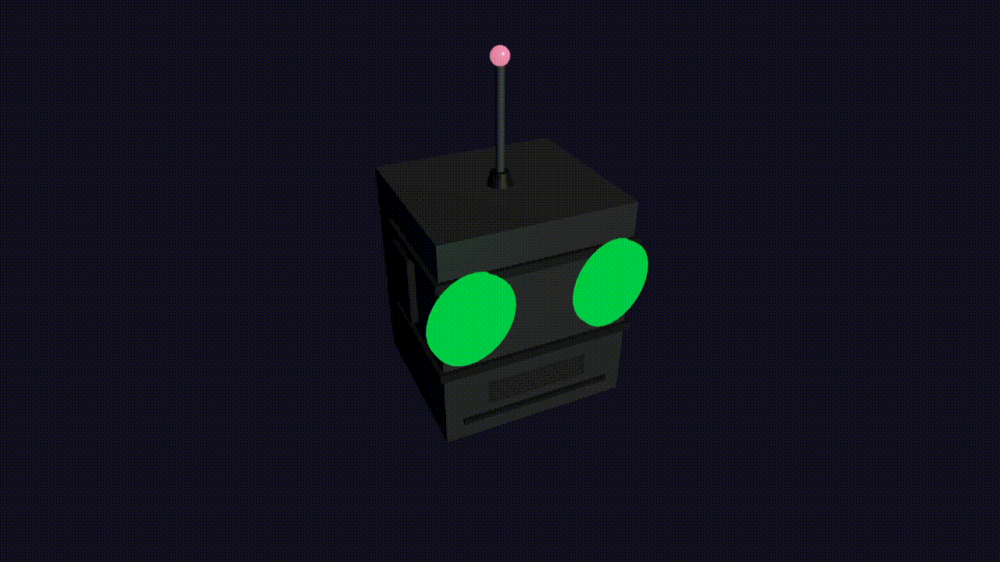

# Robot-perspective

## Robot head with interactive tracking eyes and wiggling antenna
Featuring fluorescent eye tracking indicators that glow brighter when centered on the mouse cursor and ears that retract based on camera position



## Installation

```
npm install
npm run dev
npm run build
```